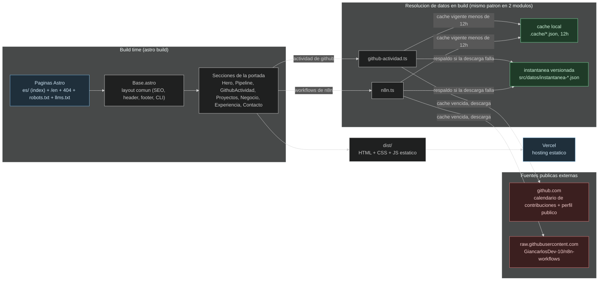

# misitioweb — Spec técnica (ingeniería inversa)

Generado por `repo-to-spec` a partir de
[GiancarlosDev-10/misitioweb](https://github.com/GiancarlosDev-10/misitioweb)
(`HEAD` al momento de la corrida, clon superficial `--depth 1`).

Todo lo que sigue está verificado contra el código real del repo, no contra
su `README.md` — el README se usó solo para orientar la exploración.

## Problem Statement

Giancarlos Ormeño (full-stack & automation developer, Lima, Perú) necesita un
sitio de portafolio propio que funcione como evidencia verificable de su
trabajo — no una lista de afirmaciones, sino datos reales (actividad de
GitHub, workflows de automatización publicados) que un visitante o un
reclutador pueda contrastar por sí mismo.

## Solution

Un sitio estático (Astro, sin backend propio) desplegado en Vercel, en
español por defecto (`/`) e inglés (`/en`), que combina contenido editorial
fijo (experiencia, casos de negocio, proyectos) con datos resueltos en
**build time** desde dos fuentes públicas externas: el perfil de GitHub del
autor y un repositorio separado (`GiancarlosDev-10/n8n-workflows`) que
publica las automatizaciones reales que construyó. Ambas fuentes usan el
mismo patrón de caché de 12h + instantánea versionada como respaldo si la
fuente externa no responde, así que el sitio nunca depende de que GitHub
esté disponible en el momento exacto del build.



## User Stories

1. As a visitor, I can read the portfolio in Spanish at the root path or in English at `/en`, so that I get the right language without extra configuration.
2. As a visitor, I can see a hero section with real, build-time-computed metrics (número de workflows publicados, número de nodos totales, +5 productos, +10 años), so that the headline numbers are never manually maintained.
3. As a visitor, I can see an animated node-field background in the hero built from the actual topology of the author's published n8n workflows, so that the visual itself is grounded in real data, not decoration.
4. As a visitor, I can scroll a "before/after" business-impact section where each case types out its "antes" text and then its "después" text once it enters the viewport, so that the before/after contrast reads as a narrative, not a static list.
5. As a visitor, I can see a GitHub-style contribution heatmap (calendar, current streak, max streak, public repo count) sourced live from GitHub's own public contribution calendar HTML and profile API, so that the activity claim is independently checkable.
6. As a visitor, I can expand a "technical detail" popup on any of the 6 case-study projects to see its modules, architecture note, and stack, so that I get engineering depth without cluttering the main list.
7. As a visitor, I can — for the two case studies that map to a real n8n workflow group (`colegio`, `workflows`) — see, inside that same popup, each linked workflow's actual node count, a build-time-rendered SVG of its node topology, its detected technology badges, and a link to its raw JSON on GitHub, so that the automation claim is backed by an inspectable artifact.
8. As a visitor, I can open a floating terminal overlay (button, or pressing `/`) and run curated commands (`help`, `whoami`, `about`, `experience`, `projects`, `contact`, `clear`, `exit`, `sudo`) against the same content already on the page, so that I can explore the same information in a CLI-flavored interface if I prefer that over scrolling.
9. As a visitor, I can use arrow-up/down to recall previous terminal commands and Tab to autocomplete a partial command name, so that the terminal behaves like a real shell.
10. As a visitor typing an unknown terminal command, I get a "command not found" message plus a suggested closest command (Levenshtein distance ≤ 2), so that a typo doesn't leave me stuck.
11. As a mobile visitor, I can open the terminal without the on-screen keyboard breaking the overlay's layout, because the component syncs its height/offset to `visualViewport` and locks body scroll while open.
12. As a visitor with `prefers-reduced-motion: reduce` set, I get every animation (scroll-reveal, terminal typing, hero counters, before/after typing) rendered instantly in its final state instead of animated, so that motion sensitivity is respected everywhere, not just in one place.
13. As a visitor, I can navigate a header that shrinks into a compact pill after 24px of scroll and exposes a centered dropdown menu instead of a horizontal nav, so that navigation stays reachable without permanently occupying header height.
14. As a mobile visitor, I get a separate slide-down mobile menu (distinct from the desktop compact dropdown) that closes on link click, on Escape, or automatically if the viewport crosses back to desktop width while open.
15. As a visitor, I can download the author's CV in the language I'm currently browsing in (`/cv/giancarlos-ormeno-cv-es.pdf` or `-en.pdf`), so that the CV matches the page language.
16. As a visitor, I can reach the author over WhatsApp (prefilled `wa.me` link), email, phone, or LinkedIn from a dedicated contact section, so that I have a direct channel with no contact form or backend in between.
17. As a search engine or AI crawler, I can fetch `/robots.txt` (custom-generated, disallowing `/api/`, `/admin/`, `/_astro/`, and any querystring) and `/sitemap-index.xml` (from `@astrojs/sitemap`, aware of both locales), so that indexing follows the author's explicit rules.
18. As an AI crawler, I can fetch `/llms.txt` and get a plain-text summary of who the author is, verifiable project results, and the exact list of published n8n workflows with their real node counts and raw-JSON URLs — all numbers pulled from the same build-time data as the rest of the site, so that an LLM reading this site gets facts, not marketing copy.
19. As a visitor, I get a single JSON-LD graph (`Person` + `WebSite` + `ProfessionalService` + one `SoftwareApplication` per project with a live URL) on every page, so that structured data stays consistent site-wide from one source.
20. As a visitor on any page, I get correct `hreflang` alternates (`es-PE`, `en`, and `x-default` pointing at the Spanish version) and a canonical URL with no trailing slash, so that search engines don't see the two languages as duplicate content.
21. As a visitor hitting a non-existent route, I get a custom 404 page (in Spanish, `noindex`) with a link back home, instead of a generic error page.
22. As the site owner, when GitHub's contribution calendar or the n8n-workflows repo is unreachable at build time, the build still succeeds using the versioned snapshot JSON committed in the repo, so that a transient external outage never blocks a deploy.

## Implementation Decisions

- **Stack observado**: Astro 7 (contenido estático, cero framework de UI — todo es `.astro` + vanilla `<script>`), Tailwind CSS 4 vía plugin de Vite, TypeScript estricto (`astro/tsconfigs/strict`), Bun como package manager/runtime (`bun.lock`, README exige Bun ≥ 1.3), `@astrojs/sitemap` para el sitemap, `sharp` (con `overrides` fijado) para procesamiento de imágenes en build.
- **Ruteo i18n manual, no automático**: no hay middleware ni `[locale]` dinámico — el español vive en `src/pages/index.astro` y el inglés está literalmente duplicado en `src/pages/en/index.astro`, ambos importando el mismo `Portada.astro` con `idioma` distinto. `src/i18n/index.ts` resuelve el diccionario (`es.json`/`en.json`) y expone `idiomaDeUrl`, `otroIdioma`, `rutaIdioma` — el español es la fuente de verdad del *shape* del contenido (`type Contenido = typeof es`), así que cualquier idioma nuevo tiene que replicar esa forma exacta.
- **Resolución de datos en build con caché + respaldo (patrón idéntico en dos módulos)**: `src/datos/github-actividad.ts` y `src/datos/n8n.ts` implementan el mismo patrón, confirmado explícitamente en el propio código (`// Mismo patrón que n8n.ts`): leer `.cache/*.json` si tiene menos de 12h; si no, descargar de la fuente pública; al descargar con éxito, reescribir tanto la caché como una instantánea versionada bajo `src/datos/instantanea-*.json`; si la descarga falla, leer esa instantánea versionada como último recurso. Ninguna de las dos fuentes requiere token — la actividad de GitHub se lee scrapeando el HTML público del calendario de contribuciones (`github.com/users/:usuario/contributions`), no la API GraphQL oficial (que sí exige token).

  ```mermaid
  ---
  config:
    theme: dark
  ---
  sequenceDiagram
      participant Build as proceso de build
      participant Modulo as modulo de datos (github-actividad.ts / n8n.ts)
      participant Cache as .cache/*.json
      participant Fuente as fuente publica (GitHub o n8n-workflows)
      participant Snapshot as instantanea versionada

      Build->>Modulo: obtenerActividadGithub() / obtenerWorkflows()
      Modulo->>Cache: leer cache
      alt cache con menos de 12h
          Cache-->>Modulo: datos cacheados
      else cache vencida o ausente
          Modulo->>Fuente: descargar datos
          alt descarga exitosa
              Fuente-->>Modulo: datos frescos
              Modulo->>Cache: escribir cache
              Modulo->>Snapshot: escribir instantanea
          else descarga falla
              Modulo->>Snapshot: leer instantanea
              Snapshot-->>Modulo: datos de respaldo
          end
      end
      Modulo-->>Build: datos resueltos
  ```

- **Registro de workflows declarado a mano, análisis derivado**: `REGISTRO_WORKFLOWS` en `n8n.ts` declara a mano solo `id`, `caso`, `nombre` (es/en) y `ruta` de cada uno de los 9 workflows publicados; todo lo demás (conteo de nodos, badges de tecnología, topología normalizada 0–1 para el canvas SVG, aristas entre nodos) se deriva del JSON real descargado — nada de eso se escribe a mano.
- **Traducción de tipos de nodo n8n a etiquetas legibles**: `src/datos/mapa-nodos.ts` mapea ~28 tipos de nodo conocidos (`n8n-nodes-base.whatsApp` → "WhatsApp", `@n8n/n8n-nodes-langchain.agent` → "AI Agent", etc.) a etiquetas de badge; ignora explícitamente nodos de "plomería" (`set`, `if`, `switch`, `merge`, `noOp`, etc.) que no aportan información; cualquier tipo no mapeado cae a un fallback que humaniza el nombre del tipo (`camelCase` → palabras separadas, capitalizado).
- **Topología SVG 100% build-time, sin JS**: `Topologia.astro` construye el SVG del grafo de un workflow (líneas + puntos) directamente en build time a partir de las coordenadas normalizadas y las aristas ya calculadas — no hay canvas ni librería de gráficos en el cliente para esta pieza.
- **Vinculación proyecto ↔ workflows por campo `caso`**: de los 6 proyectos declarados en `es.json`/`en.json` (`colegio`, `ure`, `workflows`, `analia`, `latelier`, `pablo`), solo `colegio` y `workflows` tienen `id` que coincide con algún `caso` de `REGISTRO_WORKFLOWS`; son los únicos dos cuyo popup de detalle técnico muestra la sección de workflows vinculados — los otros 4 muestran solo módulos/arquitectura/stack, sin esa sección.
- **Terminal CLI como capa de presentación alternativa, no un sistema aparte**: `TerminalCli.astro` no inventa contenido ni un filesystem falso — los datos que sirve (about, experiencia, proyectos, contacto) se pasan por props desde `SITIO` y el diccionario `i18n` ya resueltos por el layout, serializados a un `<script type="application/json">` embebido y leídos por el script del cliente.
- **SEO centralizado en un único punto de configuración**: `src/datos/sitio.ts` (`SITIO`) es la única fuente para URL canónica base, contacto, redes y rutas de CV — `Meta.astro` deriva de ahí canonical, `hreflang` (incluyendo `x-default`→es), Open Graph y Twitter Card; `DatosEstructurados.astro` deriva de ahí un único grafo JSON-LD (`Person` + `WebSite` + `ProfessionalService` + un `SoftwareApplication` por proyecto con `urlVivo`).
- **Cabeceras de seguridad y caché a nivel de plataforma, no de aplicación**: `vercel.json` fija `X-Content-Type-Options`, `X-Frame-Options: DENY`, `Referrer-Policy`, `Permissions-Policy` (bloquea cámara/micrófono/geolocalización) para todas las rutas, y cache inmutable de 1 año para `/fuentes/*` (los `.woff2` autoalojados).
- **Assets de marca regenerables, no parte del build normal**: `scripts/generar-imagenes.py` (Python + Pillow, fuera del pipeline de `bun run build`) regenera favicon/apple-touch-icon/imagen OG a partir de las fuentes tipográficas y los datos de workflows; es una herramienta manual, no se ejecuta en CI/deploy.

## Testing Decisions

- **No hay tests automatizados en el repo** — no existe carpeta `test`/`tests`/`__tests__`, ni ninguna dependencia de testing (Vitest, Playwright, etc.) en `package.json`.
- **No hay CI configurado** — no existe `.github/` en el repo; el único chequeo automatizado disponible es `bun run typecheck` (alias de `astro check`), que también se usa como script de `lint`.
- Dado que no hay tests, no hay patrones de testing previos que citar como prior art.

## Out of Scope

- Sin backend propio ni base de datos — es un sitio 100% estático (`astro build` → `dist/`); toda "dinámica" (actividad de GitHub, workflows de n8n) se resuelve en build time, no en request time.
- Sin formulario de contacto server-side — el contacto son enlaces directos (`mailto:`, `tel:`, `wa.me`), no hay endpoint que reciba envíos.
- Sin analítica ni telemetría de ningún tipo — no se encontró ningún script de analytics (Google Analytics, Plausible, PostHog, etc.) en el código.
- Sin autenticación ni áreas privadas.
- Sin más idiomas que español e inglés — el mecanismo de i18n es manual (páginas duplicadas + diccionario), agregar un idioma implica trabajo explícito descrito en el propio README, no una config declarativa.
- Sin CMS ni fuente de contenido editable sin tocar código — el copy vive en `src/i18n/{es,en}.json`, versionado junto al código.

## Further Notes

- El propio código documenta explícitamente una referencia de diseño ("versión acotada de la idea de cris.fast", "mismo patrón STATED → SIMULATED de aaru.com") para el terminal CLI y el efecto de tipeo de la sección de negocio — es una decisión de estilo deliberada, no una coincidencia de implementación.
- Hay atención deliberada a accesibilidad y rendimiento percibido en varios puntos concretos: skip-link al contenido principal, `aria-haspopup`/`aria-modal` en los tres overlays (terminal, popup de detalle de proyecto, menú móvil), manejo explícito de `prefers-reduced-motion` en cuatro animaciones distintas (scroll-reveal global, terminal, contador del hero, tipeo de negocio), y un comentario explícito en `Negocio.astro` sobre evitar forced reflow separando fases de lectura y escritura del DOM.
- Riesgo operativo real y ya mitigado en el propio código: si `github.com`/`raw.githubusercontent.com` no responden durante un build, el sitio sigue publicándose gracias al respaldo de instantánea versionada — pero eso también significa que un build exitoso puede estar sirviendo datos de actividad/workflows desactualizados sin ningún aviso visible al visitante.
- `scripts/extraer-retrato.mjs` y `scripts/extraer-silueta.mjs` (no explorados en profundidad — herramientas de preparación de assets, no parte del runtime del sitio ni del build de producción) quedan fuera del alcance de esta profundización; si se necesita entender ese pipeline de generación de imágenes en detalle, es un área a revisar aparte.